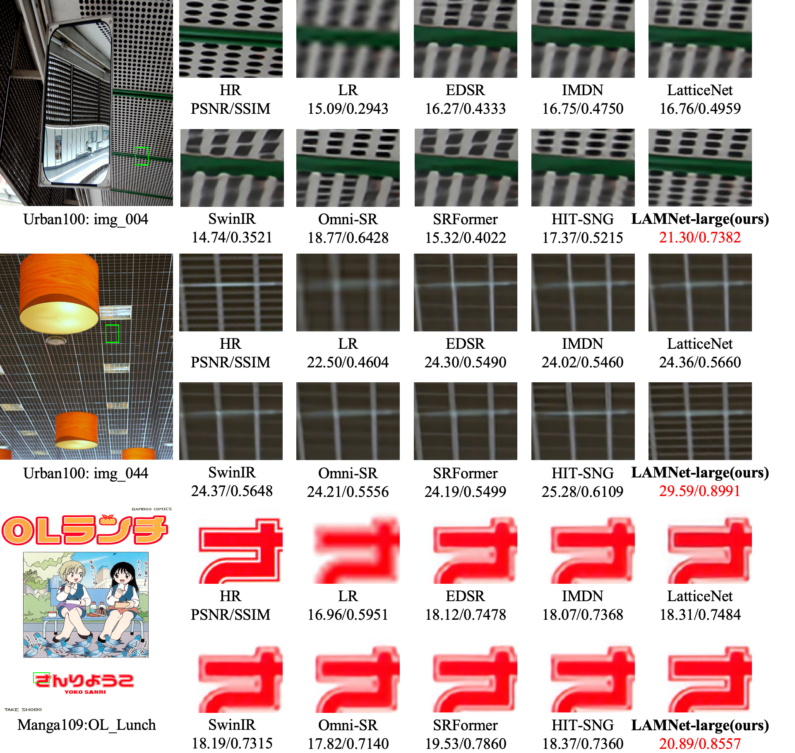
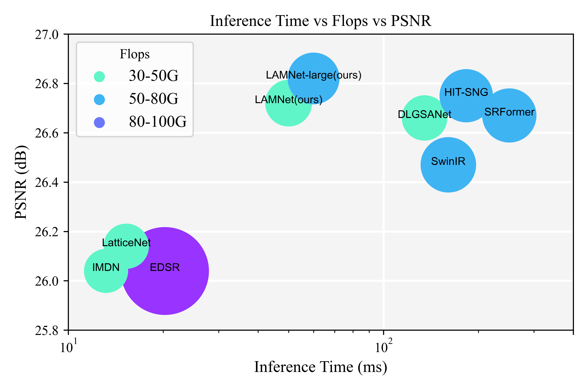

# Unifying Dimensions: A Linear Adaptive Mixer for Lightweight Image Super-Resolution
This repository contains the official PyTorch Implementation of "Unifying Dimensions: A Linear Adaptive Mixer for Lightweight Image Super-Resolution"

[\[Paper\]]() [\[Code\]](https://github.com/zononhzy/LAMNet) [\[Visual Results\]]() 

## Method Overview
<!-- <p align="center">  </p> -->

> <b>Abstract</b>: Window-based transformers have demonstrated outstanding performance in super-resolution tasks due to their adaptive modeling capabilities through local self-attention (SA). However, they exhibit higher computational complexity and inference latency than convolutional neural networks. In this paper, we first identify that the adaptability of the Transformers is derived from their adaptive spatial aggregation and advanced structural design, while their high latency results from the computational costs and memory layout transformations associated with the local SA. To simulate this aggregation approach, we propose an effective convolution-based linear focal separable attention (FSA), allowing for long-range dynamic modeling with linear complexity. Additionally, we introduce an effective dual-branch structure combined with an ultra-lightweight information exchange module (IEM) to enhance the aggregation of information by the Token Mixer. Finally, with respect to the structure, we modify the existing spatial-gate-based feedforward neural networks by incorporating a self-gate mechanism to preserve high-dimensional channel information, enabling the modeling of more complex relationships. With these advancements, we construct a convolution-based Transformer framework named the linear adaptive mixer network (LAMNet). Extensive experiments demonstrate that LAMNet achieves better performance than existing SA-based Transformer methods while maintaining the computational efficiency of convolutional neural networks, which can achieve a $3\times$ speedup of inference time. The code will be publicly available at: https://github.com/zononhzy/LAMNet

## Detail Contents
1. [Installation & Dataset](#installation--dataset)
2. [Training](#training)
3. [Testing](#testing)
4. [Results](#results)
5. [Citations](#citations)
6. [Acknowledgement](#acknowledgement)
7. [Contact](#contact)

## Installation & Dataset
- python 3.8
- pyTorch == 2.1

```bash
cd LAMNet
pip install -r requirements.txt
python setup.py develop

# install fsa
cd basicsr/ops/fsa
python setup.py build install
```

## Dataset
We used only DIV2K dataset to train our model. Please download the DIV2K dataset from [here](https://cv.snu.ac.kr/research/EDSR/DIV2K.tar).

The test set contains five datasets, Set5, Set14, B100, Urban100, Manga109. The benchmark can be downloaded from [here](https://drive.google.com/drive/folders/1xyiuTr6ga6ni-yfTP7kyPHRmfBakWovo)

#### Please note in Datasets Preparation
* If you do not use lmdb datasets, you may need to crop the training images into sub_images for reducing I/O times. Please follow [here](https://github.com/XPixelGroup/BasicSR/blob/master/docs/DatasetPreparation.md#DIV2K).
* After downloading the test datasets you need, you maybe need to get the downsample LR image. Please follow [here](https://github.com/yulunzhang/RCAN#the-whole-test-pipeline).


## Training
1. Please download the dataset and place them in the folder specified by the training option in folder `/options`.
2. Follow the instructions below to train our LAMNet (todo).

# 

## Testing
```bash
# test SPAN for lightweight SR task
python basicsr/test.py -opt options/test_LAMNet_SRx2.yml
python basicsr/test.py -opt options/test_LAMNet_SRx3.yml
python basicsr/test.py -opt options/test_LAMNet_SRx4.yml
```

## Results
<a id="result"></a>
We provide the results on lightweight image SR. More results can be found in the [paper](). The visual results of LAMNet can be found in [\[Visual Results\]]().

Visual Results

<p align="center">
  
</p>

Performance comparison

<p align="center">
  
</p>

## Citations
You may want to cite:
```
```

## Acknowledgement
The codes are based on  [BasicSR](https://github.com/XPixelGroup/BasicSR), [Swin Transformer](https://github.com/microsoft/Swin-Transformer), and [SwinIR](https://github.com/JingyunLiang/SwinIR). Please also follow their licenses. Thanks for their awesome works.

## Contact
If you have any question, please email zhenyuhu@whu.edu.cn.